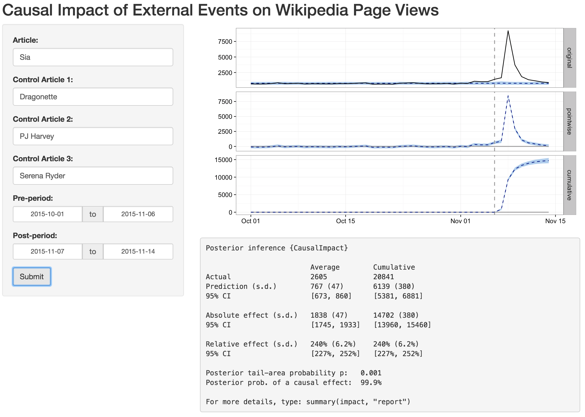

## Web Application

This subdirectory contains an R Shiny web application to run causal impact analyses of external events on Wikipedia page views.

Causal impact is modeled using Google's [Causal Impact](https://google.github.io/CausalImpact/) R package which implements the algorithms described in the publication [Inferring Causal Impact Using Bayesian Structural Time-Series Models](http://research.google.com/pubs/pub41854.html).  Time series of Wikipedia page views are obtained using the [pageviews](https://github.com/Ironholds/pageviews) R package.

The model is trained using time series of Wikipedia page views for the article thought to be impacted by the external event, as well as similar articles which are presumed not to have been impacted. The resulting model predicts the counterfactual time series. That is, the time series for the impacted article 
that would have resulted had the external event not occurred. By considering the difference between the actual time series and the counterfactual one, the causal impact can be determined.

An example is shown below.



In this example, measurements are made of the causal impact of the musician *Sia*'s Saturday Night Live appearance on her Wikipeda page view time series.  The three musicians for the control articles were chosen using [Music-Map](http://www.music-map.com/disclosure.html). The **Pre-period** is the time before the appearance on Saturday Night Live; the **Post-period** is the time after the appearance.

The results of the model are visualized in three panels. The first one shows the actual page views for *Sia* and the counterfactual predition. The second panel displays the difference between the actual and counterfactual. The last panel is the cumulative increase in views of the *Sia's* article as a result of her appearance on Saturday Night Live. The blue highlighting identifies the confidence interval.

To execute the app, you will need to:  
1. Install R  
2. Install [R Wikipedia Pageviews Client](https://github.com/Ironholds/pageviews)  
3. From an R session, execute the following commands, which will install causal impact and shiny, then run the shiny app.
```R
  > install.packages("devtools")
  > library(devtools)
  > devtools::install_github("google/CausalImpact")
  > library(CausalImpact)
  > library(shiny)
  > runApp("shinyapp")
```

Queries to the web application are logged in the file *causalimpact.csv*.  Each line has the current time and day, along with the values input to the Shiny app for the query.